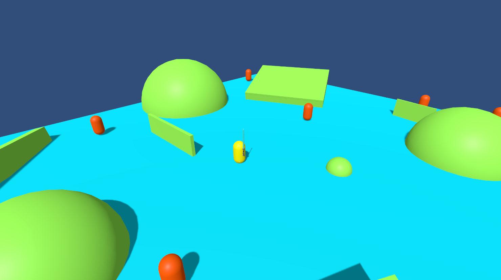

# Cahier des charges : Projet XR

## Matériel

- 1 Casque de réalité virtuelle
- 1 Manette

## Description

Équipé de son courage et d'un sabre laser, le joueur va devoir lutter pour sa survie. Des PNJ assoiffés de sang comptent bien le poursuivre pour le percuter jusqu'à la mort.
Afin d'éviter les ennemis le joueur pourra se déplacer dans monde virtuel constitué de plateformes de quelques metres de large et sur lesquelles se trouvent des obstacles. Grâce à des portails activables en y apposant la main, le joueur peut se téléporter sur une autre plateforme pour échapper, très temporairement aux PNJ.

## Intelligence artificielle

Les PNJ seront générés par un algorithme génétique qui les fera progressivement évoluer pour les améliorer ou leur donner de nouvelles capacités afin de faire monter progressivement le niveau de difficuleté du jeu. Ils deviendront également plus intelligents, choisissant progressivement le meilleur chemin.

## Multijoueur

Un second joueur pourra assister le joueur principal en donnant des instructions qui lui permettront de savoir quelle direction prendre pour éviter les ennemis en se déplaçant de plateforme en plateforme.
